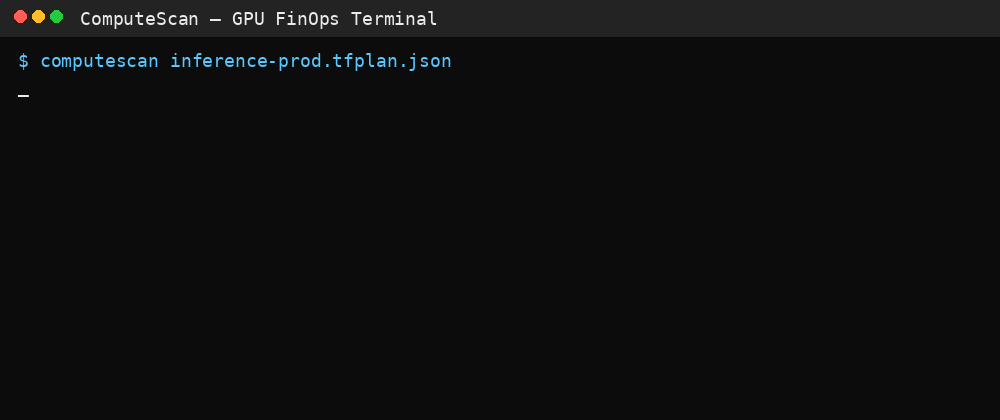

  

---

# Hi, I'm Dee 👋  
AI Infrastructure Architect focused on Terraform plan correctness, GPU FinOps, and secure RAG pipelines.

I build deterministic, offline-first governance tools that help teams ship AI infra with confidence — no telemetry, no guesswork, and no black boxes.

---

# 🚀 GuardSuite  
**Security + FinOps governance for Terraform plans.**  
Purpose-built for modern AI, GPU-heavy, and RAG workloads.

## 🔹 Free Scanners  
**VectorScan** — High-signal scanner for RAG/vector database security  
👉 https://github.com/GuardSuite/VectorScan  

**ComputeScan** — Detects GPU cost drift, autoscaling issues, and utilization waste  
👉 https://github.com/GuardSuite/ComputeScan  

---

# 💼 Paid Governance Blueprints  
Commercial-grade governance for teams that need executive-level proof.

### **VectorGuard Blueprint — $79/year**  
**Auditable Compliance Ledger for Zero-Trust RAG security.**  
Get CISO-grade proof, not just alerts. Deterministic OPA policies, full drift analysis, and an exportable governance artifact.

### **ComputeGuard Blueprint — $129/year**  
**CFO-ready Zero-Waste Score for GPU cost certainty.**  
Complete drift autopsy, underutilization detection, GPU-rightsizing intelligence, and FinOps-grade governance reporting.

---

# 📘 Demo Repository  
**Live Failures:** Real Terraform plans demonstrating critical vector security flaws and GPU cost risks — validated by both scanners.  
👉 https://github.com/GuardSuite/terraform-governance-demo

---

# 🧰 Featured Work

### **ShieldCraft AI**  
AWS-native reference architecture for secure, production-grade AI systems.  
👉 https://github.com/ShieldCraft-AI/ShieldCraft-AI

### **CodeCraft AI**  
Minimal, AWS-native MLOps/RAG framework for rapid experimentation and deployment.  
👉 https://github.com/Dee66/CodeCraft-AI

---

# 🔍 What I Focus On  
- Terraform plan parsing & correctness  
- OPA / Rego deterministic policy engines  
- Vector DB / RAG security  
- GPU FinOps & rightsizing governance  
- Drift detection for AI infrastructure  
- Zero-trust, offline-first tooling  
- AWS-native AI platforms  
- Secure MLOps & LLM deployment pipelines  

---

### 📫 Contact  
support@shieldcraft-ai.com
