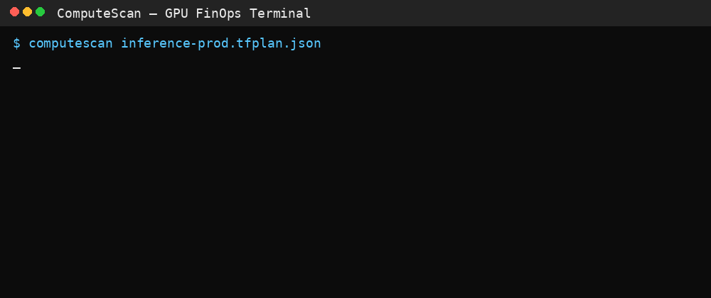

# The Deterministic Toolsmith  
### Engineering for Safety First Decisions

Hi, I’m Dee.

I build deterministic, offline developer tooling for AI and cloud systems.

I do this because I have repeatedly seen capable teams make the **wrong first change** in unfamiliar systems. Not due to incompetence but due to false confidence produced by shallow analysis tools.

My work focuses on **decision safety**: helping engineers understand what is safe to change, what is risky, and when judgment - not action - is required.

---

## Foundational Principles (Engineering Invariants)

My tooling optimizes for **trust over speed**.

- Outputs must be **deterministic, auditable, and grounded only in observable evidence**
- I avoid speculative inference and prefer **explicitly bounded conclusions**
- If a conclusion cannot be supported safely, **silence is a valid outcome**

These constraints are intentional. They prevent tools from projecting authority they have not earned.

---

## What I Work On

I design and build tools that:

- Analyze repositories, infrastructure plans, and AI pipelines **without executing them**
- Produce **reproducible outputs** (same input → same result → same hash)
- Bound conclusions explicitly instead of implying certainty
- Run safely **offline**, with zero permissions and no network access
- Prefer measured judgment over exhaustive reporting

These tools are built for engineers inheriting unfamiliar systems, technical leads deciding where to start, and teams that value confidence over activity.

---

## Selected Work: Decision Safety Tooling

### VectorScan (Open Source · AI & RAG Security · Python)

Static security scanner for vector databases and RAG systems.

- Detects exposure, configuration drift, and data leakage risks
- Structural analysis only. No credentials, no execution
- **Refuses to speculate** on runtime behavior or business logic

https://github.com/Dee66/VectorScan

---

### ComputeScan (Infrastructure & FinOps · Core: HCL Static Analysis)

Offline analysis of Terraform plans for compute and GPU cost risk.

- Identifies oversizing, idle patterns, scaling misconfiguration, and tag drift
- Designed for ML infrastructure and FinOps review
- **Deliberately ignores** performance claims it cannot verify statically

---

### CostPilot (In Progress · FinOps Regression Control · Python)

Deterministic FinOps engine for infrastructure-as-code.

- Detects and predicts AWS cost regressions before deployment
- Evaluates cost SLOs and produces auditable impact reports
- **Does not auto-apply changes** without bounded confidence

---

## Deterministic Offline Analysis (Example)

Example: Static, offline analysis demonstrating absolute determinism.  
Same input → same output → confident review before any change is made.

  

---

## Current Focus: The Litmus Engine (In Progress)

I am building an open-source engine that formalizes **senior-grade repository review**.

The Litmus Engine exists to answer one question before any action is taken:

**Where can pressure be applied safely - and where must it not?**

It focuses on:

- Defining the **Safe-to-Change Surface** in unfamiliar codebases
- Explicitly surfacing where conclusions must be bounded
- Identifying cases where **no safe move exists yet**
- Explaining where less sophisticated tools would mislead

This engine is not designed to replace human judgment.  
It exists to **support it, not counterfeit it**.

---

## Contact

- **Architectural critique & tooling discussion:** via GitHub issues on relevant repositories  
- **Professional context:** [LinkedIn – Deon Prinsloo](https://www.linkedin.com/in/deon-prinsloo-aws)
